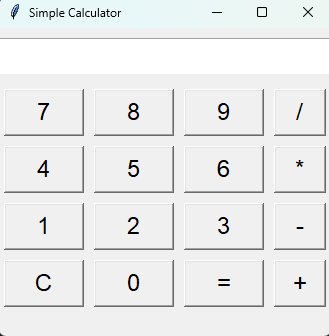
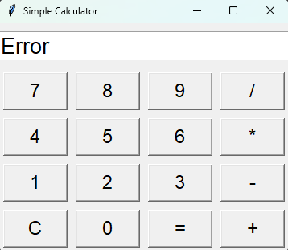

# Python GUI Calculator

Welcome to the **Python GUI Calculator Project**!  
This is a simple calculator built using **Tkinter**
---

## ✨ Features

- Basic arithmetic operations: Add, Subtract, Multiply, Divide
- Clear and intuitive user interface
- Error handling for invalid operations
- Easy to extend with new features (e.g., history log, dark mode)

---

## 🖥️ Preview

 
 
---

## 🧑‍💻 Getting Started

### Prerequisites
- Python 3.x installed on your system

### How to Run

`python -m main.py`